# Arktoon+T Document (日本語)

## Arktoon との差異

機能としては以下のものが追加されています。

* 受けるライトカラーの彩度を調整できる機能
* Emission 系にテクスチャのアルファチャンネルを用いたマスク
* Gloss と Reflection におけるテクスチャでのカラー指定
* Gloss の Metallic のマスクを追加
* UV Transform の追加（これに付随して２つめの Emission も追加）
* アニメーション特化のバリエーションとして Emissive Waves を追加
* Common に RenderQueue を追加し

Emission のマスクは、Emission が HDR カラーでの発光に対応したことにより、色を維持したまま発光度合いだけ抑えたい場合にマスクが必要になるため実装しました。

マップの作成手順が複雑であったり、パラメータが多かったりするため、この下で簡単に説明します。

また、バージョンは **v1.1.0.0 以降（最新版は v1.2.0.0 ）**で説明します。

[Booth](https://tokageitlab.booth.pm/items/2018270) に有料サンプルを掲載しています。

---

## UV Transform

テクスチャの一部をトリミングしながらスクロールや回転を行うことができます。

### Scroll

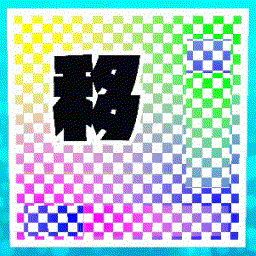

（GIF アニメは長いと重くなるため、編集でループさせています）

* Scroll Map - [スクロールマップ（後述）](#スクロールマップ)
* Scroll Speed Map - [スクロール速度マップ（後述）](#スクロール速度マップ)
* Scroll Speed - 基準となるスクロール速度

### Rotate

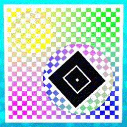

* Rotate Map - [回転マップ（後述）](#回転マップ)
* Rotate Speed Map - [回転速度マップ（後述）](#回転速度マップ)
* Rotate Speed - 基準となる回転速度

任意のテクスチャの UV Channel を該当の Channel に設定すると、変形された UV が適用されます。

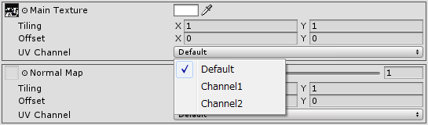

---

## Emissive Waves

トレースや点滅、色合いの変更といった周期的なアニメーションを行うものです。マテリアルを分けたりタイムラインを使ったりせずに、アニメーションのバリエーションを出せるようにしています。

* Texture & Color - Emissive Waves での発光色

### Trace

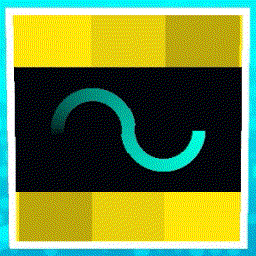

* Trace Map - [トレースマップ（後述）](#トレースマップ)
* Use Second Channel - トレースマップの G チャンネルを使用するか

#### Trace Common

* Amount - トレース時に発光色をどれだけ減衰させるか
* Freq - トレースを繰り返す周波数
* Offset - トレース周期のオフセット
* Amount & Freq & Offset Mask - 上記３つの値のマスク（RGB がそれぞれ AFO に対応します）

#### Trace In Out Ratio

* Ratio - トレースの頭と尻の比率
* Use Ratio Map - Ratio をマップで指定するか
* Ratio Map - Ratio マップ（R チャンネル）

#### Trace In / Trace Out

* Smooth - フェードをスムース補完するか（オフの場合は線形補完）
* Use Smooth Map - スムース補完の指定にマップを使用するか
* Smooth Map - スムース補完を指定するマップ（R チャンネルを参照、二値）
* Width - フェードを含めた全体の幅
* Softness - フェード具合
* Bias - フェードの指数的変化の値
* Width & Softness & Bias Mask - 上記３つの値のマスク（RGB がそれぞれ WSB に対応します）

#### Trace Unison

* Unison Count - 追加のトレースの数（処理が多くなるため最大５で制限しています）
* Use Unison Count Map - 追加のトレースの数の指定にマップを使用するか
* Unison Count Map - 追加のトレースの数を指定するマップ（R チャンネルを参照）

| 8bit Value | Reccomend | Unison Count |
|----        |----       |----          |
| 0 ~        | 0         | One          |
| 51 ~       | 77        | Two          |
| 102 ~      | 128       | Three        |
| 153 ~      | 179       | Four         |
| 204 ~      | 255       | Five         |

* Freq Multi - 追加トレースの周波数倍率
* Decay - 追加トレースの減衰率
* Offset - 追加トレースのオフセット
* Freq Multi & Decay & Offset Mask - 上記３つの値のマスク（RGB がそれぞれ FDO に対応します）

### Blink

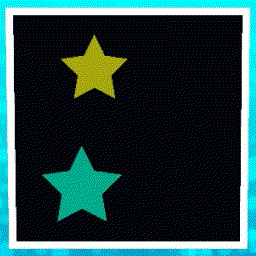

* Wave Type - 波の形状（コサイン波，三角波，矩形波，鋸歯状波，カスタム波）
* Use Wave Type Map - 波の形状をマップで指定するか
* Wave Type Map - 波の形状を指定するマップ（R チャンネルを参照）

| 8bit Value | Reccomend | Wave Type |
|----        |----       |----       |
| 0 ~        | 0         | Cos       |
| 51 ~       | 77        | Tri       |
| 102 ~      | 128       | Sqr       |
| 153 ~      | 179       | Saw       |
| 204 ~      | 255       | Custom    |

* Custom Wave Map - カスタム波を生成する [1D マップ（後述）](#1D-マップ)
* Blink Invert - 波の明暗反転
* Power - 波を冪乗する指数
* Power Invert - 波の指数反転

#### Blink Common

* Amount - 点滅時に発光色をどれだけ減衰させるか
* Freq - 点滅周波数
* Offset - 点滅周期のオフセット
* Amount & Freq & Offset Mask - 上記３つの値のマスク（RGB がそれぞれ AFO に対応します）

#### Blink Unison

* Unison Count - 加算波の数（処理が多くなるため最大５で制限しています）
* Use Unison Count Map - 加算波の数の指定にマップを使用するか
* Unison Count Map - 加算波の数を指定するマップ（R チャンネルを参照）

| 8bit Value | Reccomend | Unison Count |
|----        |----       |----          |
| 0 ~        | 0         | One          |
| 51 ~       | 77        | Two          |
| 102 ~      | 128       | Three        |
| 153 ~      | 179       | Four         |
| 204 ~      | 255       | Five         |

* Freq Multi - 加算波の周波数倍率
* Decay - 加算波の減衰率
* Offset - 加算波のオフセット
* Freq Multi & Decay & Offset Mask - 上記３つの値のマスク（RGB がそれぞれ FDO に対応します）
* Normalize - 正規化するか（オフの場合は 0.0 ~ 1.0 の値をはみ出すとクロップします）
* Use Normalize Map - 正規化の指定にマップを使用するか
* Normalize Map - 正規化を指定するマップ（R チャンネルを参照、二値）

### Tint

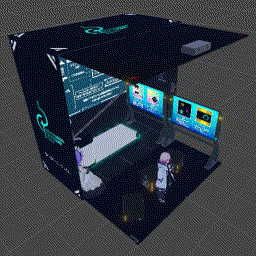

* Tint Map & Color - 色合いを決める [1D マップ（後述）](#1D-マップ)とそれに乗算される色
* Tint Type - どの Tint Map & Color を使用するか
* Use Tint Type Map - Tint Type の指定にマップを使用するか
* Tint Type Map - Tint Type を指定するマップ

| 8bit Value | Reccomend | Tint Type |
|----        |----       |----       |
| 0 ~        | 0         | A         |
| 85 ~       | 128       | B         |
| 170 ~      | 255       | C         |

#### Tint Common

* Amount - どれだけ色合いを反映するか
* Freq - 遷移周波数
* Offset - 遷移周期のオフセット
* Amount & Freq & Offset Mask - 上記３つの値のマスク（RGB がそれぞれ AFO に対応します）

---

## 各特殊なマップの作り方

### 注意事項

1. スクロールマップおよび回転マップはアンチエイリアスを切ることを強く推奨します
2. スクロールマップおよび回転マップは OpenEXR の 32bit float モードを強く推奨します
3. スクロールマップおよび回転マップの Unity での圧縮設定は None で、色は RGBA 32bit にすることがほぼ必須です
4. スクロールマップおよび回転マップや変形を適用するテクスチャは Mip Map を生成しないでください

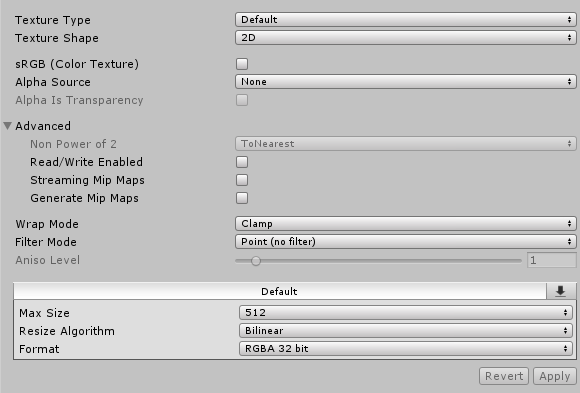

RGBA 32bit の画像はビルドサイズが大きくなりますが、**スクロールマップ**と**回転マップ**は**解像度自体はそれほど重要ではありません**ので、テクスチャサイズは小さめでも問題ありません。その代わり、**速度マップの解像度は大きめにして、前述の RGBA 32bit のマップを若干トリムする形**を推奨いたします。要するに、**エンジン側の色変換やスケーリング時の補完で画像が滲んで予想しない色、すなわち目的ではない座標の指定が現れることを極力防ぐ**ということです。それでも誤差が出る場合があるので、できるだけ指定する色が綺麗な数値になるのが理想ですが、難しいことも理解しています。UV 展開の簡素化やマテリアルの統合とトレードオフと考えてください。

また、マップやマスク全般に言えることですが、画像作成時は極力リニアカラースペースで作業した方が良いです。Wrap Mode などは画像の端までマップの値があるかどうかで挙動が変わるため、都度 Repeat などに設定してみてください。

---

### スクロールマップ

R チャンネルを幅、G チャンネルを高さ、B チャンネルをグループ ID とします。

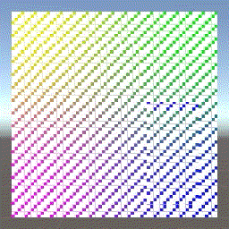

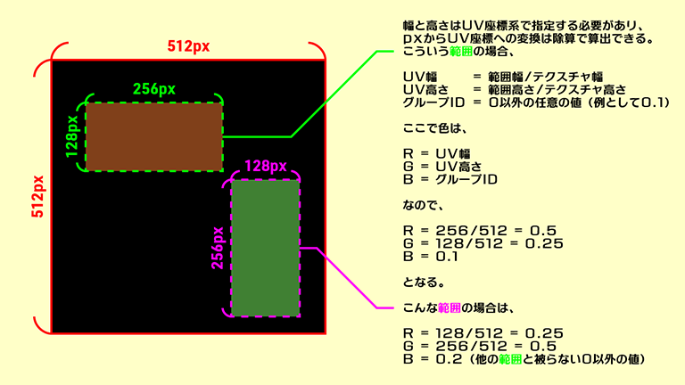

グループ ID については、複数のスクロール範囲がある場合の判定に必須です。0 でないかつ同じ値であれば同一のスクロール範囲と見なされます。範囲が一つしかない場合は 1.0 で問題ありません。もし範囲が二つなら 0.1 と 0.2 など別の値にしてください。

### スクロール速度マップ

R チャンネルを速度、G チャンネルを角度とします。

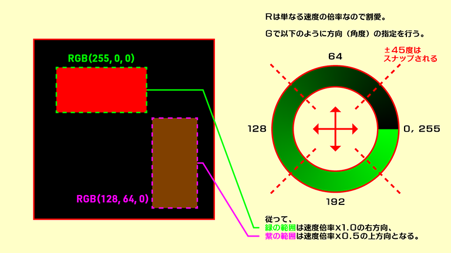

速度が 0 の部分はスクロールしません。

---

### 回転マップ

R チャンネルを中心 U 座標、G チャンネルを中心 V 座標とします。

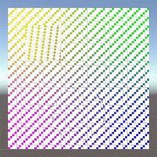

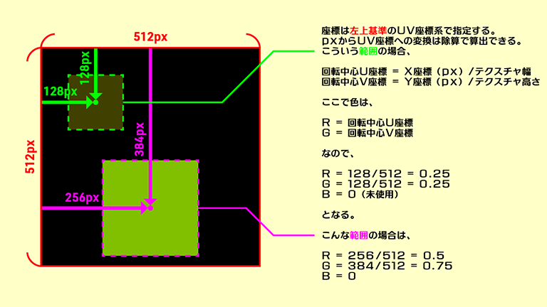

小数点誤差で軸がぶれやすいため、気になる場合は回転の中心 UV 座標を小数点以下の桁数が 3 桁以内になるような場所（全体が 4096px なら 512 の倍数 px など）に設定することを推奨します。

### 回転速度マップ

R チャンネルを右回転の角速度、G チャンネルを左回転の角速度とします。

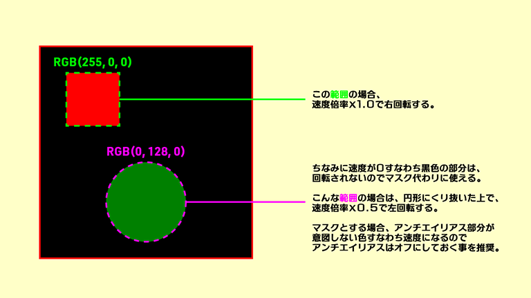

速度が 0 の部分は回転しません。両方の値が存在する場合は打ち消し合います。

---

### トレースマップ

R チャンネルを第一トレースマップ、G チャンネルを第二トレースマップ、B チャンネルをマスクとします。

詳細に説明すると長くなるので、簡単に説明します。たとえば 8bit カラーの R チャンネルのグラデーションがあったとして、0 から 255 の値の部分を順番に表示（抽出）するとします。（255 の次は 0 に戻ってまた順に表示します）

このときの抽出範囲を 10 としておくと、時間 0 の時に 0 ~ 10 の部分が表示され、時間 1 の時に 1 ~ 11 の部分が表示されるといった、帯を動かすようなアニメーションができます。それにフェードイン、フェードアウトなどを加えて実装したものがトレースです。

ただし R を 0 から 255 まで見るということは、黒が R = 0 になってしまうため、マップの黒の部分がすべて抽出されるのを防ぐためにマスクが必要になります。つまり R のグラデーションに B でマスクをかけたものをトレースマップとすることができます。さらに、同じピクセルを一周期の中で二回トレースしたい場合、一つのピクセルに値を二つ書き込めないという問題があるため、それ用に G チャンネルを用意しました。

要するに R チャンネルのグラデーションと、B チャンネルでのマスクを加算合成しています。

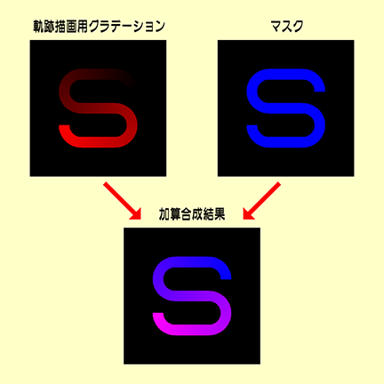

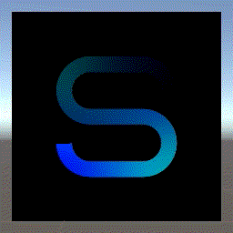

重ね合わせを使いたい場合は、このように R と G で重ね順を変えた画像をそれぞれ用意して加算合成してください。

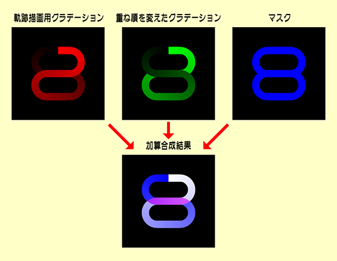

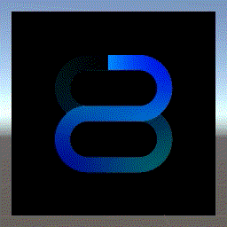

トレースマップの縁がエンジン側の補完でどうしても汚くなるので、**光らせる物よりもトレースマップの方を若干広めに作る**のがコツです。

グラデーションを滑らかにするために、スクロールマップと同様に 32bit カラーのマップを作成すれば良いと思われがちですが、**計算過程で小数の桁が溢れ、不正値がノイズとして出てくることがある**ため、**32bit カラーは非推奨**です。ビルドサイズも大きくなります。ソフトによっては作業スペースだけ 32bit や 16bit カラーにしておくと出力画像も綺麗になる場合があるので、色々と試してみてください。

余談ですが、グラデーションの始点と終点をぴったりくっつけると（円状など）、画像圧縮で始点と終点の間に予期しない色が生まれてノイズの原因になることがあります。そのため、色相を使う方法や、タンジェントマップを線形にしたものを使う方法も検討しましたが、結果としては、色相は色相を算出する時点での負荷や近似での誤差があるため適しませんでした。タンジェントマップは一応綺麗に繋がりますが、作業のし辛さや重ね合わせ時に画像数が増えることを考慮すると何ともいえず……。結果としては現在の形で、できるだけ高解像度のマップを作成するのが良いのではないか、という結論に至りました。

---

### 1D マップ

作り方について特別なことはありませんが、要するに画像の一番上の行だけを参照しています。極端な話、横 100px × 縦 1px の画像でも成立します。ただし、メモリやエンジン側の処理を考慮すると 2 の冪乗 px の方が良いかもしれません。（時代に合わせてこの辺りは変わる可能性があります）

#### カスタム波マップ

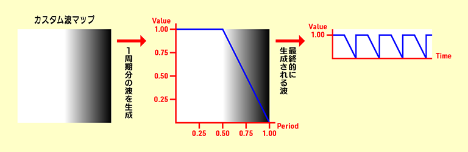

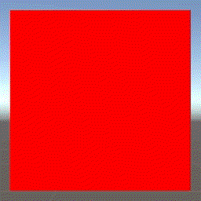

要するに明度から波を生成します。

#### 色合いマップ

グラデーションの色を左から順に割り当てます。

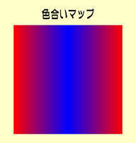

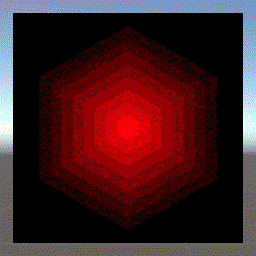

発光部分（HDR カラー）へグラデーションを適用する場合、RGB 全てのチャンネルを使った色が入っていると白くなりやすいのでご注意ください。また、RGB 全ての値が 1.0 を超えると結果として発行色が白になるので注意してください。
